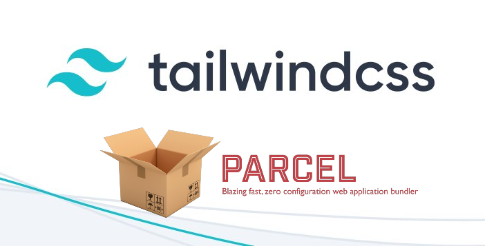

# Promo Email/Single Page Campaigns

## About 
Create and maintain mutiple modern single page sites for web or email. If you need build multiple self contained sites that are fast and handle all image ratios and compression, this is a good tool. You can set up autobuild in gitlab github to run the script and autobuild your sites.

The project uses the `parcel` to a fast workflow for front end development. This includes a hot reloading server and high standards for production deployment. This includes minification, tree-shaking unused CSS classes, linting, and optimizing images for different viewport sizes and devices. 

The contents will be available as an artifact under the `web` directory that gets created at build time. Campaigns that are active have an entry in the `active-campaigns.js` file, only these folders will be built. 

Tailwindcss is also a modern library that also allows for creativity while keeping a high standard of CSS class names.

## install libs
```
yarn
```

## build all sites in `active-campaigns.js`
```
yarn build
```

# test sites
```
docker-compose up // visit localhost:8080/siteone,  localhost:8080/sitetwo, etc.
```
## Workflow
1. Create a new folder in the `parcel/public/` directory with the name of the campaign. Ensure there are nospaces in the name, e.g. `example`
2. Copy the template provided `template.html` file to this new directory and rename it `index.html`
3. Start up parcel on the created index file to serve and get hot-reloading while coding `index.html`. 

```
   yarn parcel --no-cache public/example/index.html 
   or 
   npx parcel --no-cache public/example/index.html
   
```
4. Save all images and any other used assets into the same directory
5. The finished campaign should have a file structure like this:
```
|---parcel/
      |
      |----public/
               |
               |----[name of email campaign]/
                             |
                             |--index.html
                             |--[image files]
                             |--[other asset files]
```
6. Add the folder name to the `active-campaigns.json` as an array entry
7. Git commit, tag and push project
8. GITLAB builds those active entries found in `active-campaigns.json` and the production ready html is ready for final delopyment. For example if you have a project with files in the folder `example`

## Local Testing
This is useful to simulate a production build test on your machine with NGINX in docker

```
$ docker-compose up
$ yarn build
```
Visit in your browser http://localhost:8080/example


## Quality Control
Check the quality of the sites for syntax checks and expected. based on `sitespeed.io`

```
$ yarn performance
```

Check the results in your browser http://localhost:8080/sitespeed-result

## Requirements
- Node JS installed
- yarn or npm package manager
- Visual Studio Code for editing
- Web browser
- docker is optional to test locally on a local webserver

## Technologies 
 * parcel.js
 * partytown.js (puts google analytics and any other scripts onto a webworker off the mainthread for speed)
 * tailwindcss
 * HTML
 * node
 * yarn
 * nginx

## File Structure
```

|----public/
|       |
|       |----[name of email campaign]/
|                     |
|                     |--index.html
|                     |--[image files]
|       
|---web/
|      |--[names of email campaigns that were built]/ (built in GIT for deployment)
|                        |
|                        |--index.html
|                        |--[image files]
|
|---parcel-transformer-partytown-injector/ (plugin to include partytown.js)
|                         |
|                         |--index.js
|---fonts/ (font files)
|----base.css (imports all tailwindcss classes for use)
|----template.html (html template)
|----tailwind.config.js (tailwind config)
|----package.json (npm or yarn package list to install)
|----.gitlab-ci.yml (docker build script)
|----active-campaigns.js (define what campaigns are active to be build)
|----build.mjs (nodejs file that builds active campaigns)                        
|----logo.png (logo for project)
|----favicon.ico (favicon)


```

